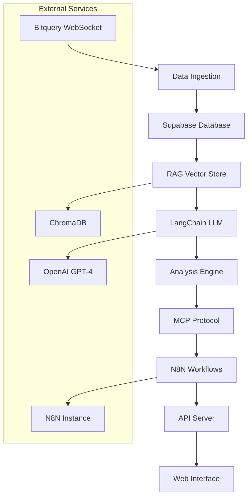

# 📈 Crypto LLM Analyst

**LLM-Powered Applications for OHLC Data Analysis**

A comprehensive system that combines real-time cryptocurrency data collection, AI-powered analysis, and automated workflows to provide intelligent insights for BTCUSDT 5-minute OHLC data.

## 🚀 Features

### Core Components

- **🔗 Bitquery Integration**: Real-time BTCUSDT 5-minute OHLC data collection via GraphQL WebSocket API
- **🗄️ Supabase Database**: Postgres database with real-time subscriptions, authentication, and instant APIs
- **🤖 LangChain Framework**: AI-powered analysis with specialized prompts for market analysis, price prediction, and technical analysis
- **🧠 RAG System**: Vector embeddings with ChromaDB for contextual data retrieval and enhanced LLM responses
- **📡 Model Context Protocol (MCP)**: Standardized AI-external system interactions with resource management and tool calling
- **⚙️ N8N Workflows**: Multi-step AI agent automation with drag-and-drop workflow builder

### Applications

- **📊 Market Analysis**: Real-time sentiment analysis and market condition assessment
- **🔮 Price Prediction**: AI-driven price forecasting with confidence intervals
- **📈 Technical Analysis**: Automated technical indicator analysis and pattern recognition  
- **🚨 Smart Alerts**: Intelligent alert system with customizable conditions
- **📄 Report Generation**: Automated market reports with AI insights
- **💼 Trading Signals**: Signal validation and analysis with market context

## 🏗️ Architecture



## 📋 Prerequisites

- **Python 3.9+**
- **OpenAI API Key** (required)
- **Bitquery API Key** (optional, for real-time data)
- **Supabase Account** (optional, for data persistence)
- **N8N Instance** (optional, for workflow automation)

## 🔧 Installation

### Quick Start

```bash
# Clone the repository
git clone https://github.com/arvinmoj/crypto-llm-analyst.git
cd crypto-llm-analyst

# Run development setup
./setup_dev.sh

# Edit configuration
cp .env.example .env
# Add your API keys to .env
```

### Manual Installation

```bash
# Create virtual environment
python -m venv venv
source venv/bin/activate  # On Windows: venv\Scripts\activate

# Install package
pip install -e .

# Install development dependencies
pip install -e ".[dev]"
```

## ⚙️ Configuration

Create a `.env` file with your API keys:

```bash
# Required
OPENAI_API_KEY=your_openai_api_key_here

# Optional (for full functionality)
BITQUERY_API_KEY=your_bitquery_api_key_here
SUPABASE_URL=https://your-project.supabase.co
SUPABASE_KEY=your_supabase_service_role_key_here
N8N_URL=http://localhost:5678
N8N_API_KEY=your_n8n_api_key_here

# Server settings
API_HOST=0.0.0.0
API_PORT=8000
ENABLE_STREAMING=true
```

### API Keys Setup

1. **OpenAI API Key**: Get from [OpenAI Platform](https://platform.openai.com/api-keys)
2. **Bitquery API Key**: Get from [Bitquery.io](https://bitquery.io/)
3. **Supabase**: Create project at [Supabase.com](https://supabase.com/)
4. **N8N**: Self-host or use [N8N Cloud](https://n8n.io/)

## 🚀 Usage

### 1. Run Examples

```bash
# Test all components
python examples/demo.py

# Run API server
python examples/run_api.py

# Run web interface
python examples/run_web.py
```

### 2. API Usage

Start the API server:
```bash
python examples/run_api.py
```

Access endpoints:
- **API Documentation**: http://localhost:8000/docs
- **Market Summary**: GET `/api/market/summary?symbol=BTCUSDT`
- **Market Analysis**: POST `/api/analysis/market`
- **Price Prediction**: POST `/api/analysis/predict`
- **Technical Analysis**: POST `/api/analysis/technical`

### 3. Web Interface

```bash
python examples/run_web.py
```
Access at: http://localhost:8501

### 4. Programmatic Usage

```python
import asyncio
from crypto_llm_analyst.main import CryptoLLMAnalyst, load_config_from_env

async def main():
    # Load configuration
    config = load_config_from_env()
    
    # Initialize system
    system = CryptoLLMAnalyst(config)
    await system.initialize()
    
    try:
        # Perform analysis
        result = await system.analyze_market(
            symbol="BTCUSDT",
            query="What's the current market sentiment?",
            analysis_type="market"
        )
        print(f"Analysis: {result['analysis']}")
        print(f"Confidence: {result['confidence']:.1%}")
        
    finally:
        await system.shutdown()

asyncio.run(main())
```

## 📚 API Reference

### Core Endpoints

#### Market Data
- `GET /api/market/summary` - Get market summary
- `GET /api/market/price` - Get current price
- `GET /api/market/ohlc` - Get OHLC data
- `GET /api/market/context` - Get market context

#### Analysis
- `POST /api/analysis/market` - Perform market analysis
- `POST /api/analysis/predict` - Generate price predictions
- `POST /api/analysis/technical` - Technical analysis
- `POST /api/analysis/general` - General queries

#### System
- `GET /api/system/status` - System component status
- `GET /api/history/analysis` - Analysis history

### Request Examples

**Market Analysis:**
```bash
curl -X POST "http://localhost:8000/api/analysis/market" \
  -H "Content-Type: application/json" \
  -d '{
    "symbol": "BTCUSDT",
    "query": "Should I buy Bitcoin now?",
    "analysis_type": "market"
  }'
```

**Price Prediction:**
```bash
curl -X POST "http://localhost:8000/api/analysis/predict" \
  -H "Content-Type: application/json" \
  -d '{
    "symbol": "BTCUSDT",
    "query": "Where will Bitcoin be in 24 hours?",
    "horizon": "24h"
  }'
```

## 🔧 Advanced Configuration

### Database Schema

The system automatically creates these tables:

```sql
-- OHLC data storage
CREATE TABLE ohlc_data (
    id SERIAL PRIMARY KEY,
    timestamp TIMESTAMPTZ NOT NULL,
    symbol VARCHAR(20) NOT NULL,
    timeframe VARCHAR(10) NOT NULL,
    open DECIMAL(20, 8) NOT NULL,
    high DECIMAL(20, 8) NOT NULL,
    low DECIMAL(20, 8) NOT NULL,
    close DECIMAL(20, 8) NOT NULL,
    volume DECIMAL(30, 8) NOT NULL,
    count INTEGER DEFAULT 0,
    created_at TIMESTAMPTZ DEFAULT NOW()
);

-- LLM analysis results
CREATE TABLE llm_analysis (
    id SERIAL PRIMARY KEY,
    timestamp TIMESTAMPTZ DEFAULT NOW(),
    symbol VARCHAR(20) NOT NULL,
    analysis_type VARCHAR(50) NOT NULL,
    query TEXT NOT NULL,
    response TEXT NOT NULL,
    confidence DECIMAL(3, 2),
    data_context JSONB,
    created_at TIMESTAMPTZ DEFAULT NOW()
);
```

### N8N Workflow Templates

The system includes pre-built workflow templates:

1. **Crypto Analysis Pipeline**: Webhook → Market Data → LLM Analysis → Response
2. **Price Alert System**: Cron → Price Check → Condition Check → Alert
3. **Market Report Generator**: Daily Schedule → Data Collection → AI Report → Email
4. **Trading Signal Processor**: Signal Input → Validation → AI Analysis → Response

## 🧪 Development

### Running Tests

```bash
# Install test dependencies
pip install -e ".[dev]"

# Run tests
pytest tests/

# Run with coverage
pytest --cov=crypto_llm_analyst tests/
```

### Code Quality

```bash
# Format code
black src/ tests/

# Lint code
ruff src/ tests/

# Type checking
mypy src/
```

### Pre-commit Hooks

```bash
# Install pre-commit hooks
pre-commit install

# Run hooks manually
pre-commit run --all-files
```

## 🔍 Monitoring

### System Status

Check component status:
```bash
curl http://localhost:8000/api/system/status
```

### Logging

Logs are written to stdout with configurable levels:
- DEBUG: Detailed debugging information
- INFO: General operational messages
- WARNING: Warning messages
- ERROR: Error messages

Set log level with `LOG_LEVEL` environment variable.

## 🚀 Deployment

### Docker Deployment

```dockerfile
FROM python:3.11-slim

WORKDIR /app
COPY . .

RUN pip install -e .

EXPOSE 8000
CMD ["python", "examples/run_api.py"]
```

### Production Considerations

1. **Security**: Use proper API key management and HTTPS
2. **Scalability**: Consider Redis for caching and message queuing
3. **Monitoring**: Implement proper logging and monitoring
4. **Database**: Use connection pooling for database connections
5. **Rate Limiting**: Implement rate limiting for API endpoints

## 🤝 Contributing

1. Fork the repository
2. Create a feature branch (`git checkout -b feature/amazing-feature`)
3. Commit your changes (`git commit -m 'Add amazing feature'`)
4. Push to the branch (`git push origin feature/amazing-feature`)
5. Open a Pull Request

### Development Guidelines

- Follow PEP 8 style guidelines
- Add type hints to new functions
- Include docstrings for public methods
- Write tests for new functionality
- Update documentation as needed

## 📄 License

This project is licensed under the MIT License - see the [LICENSE](LICENSE) file for details.

## 🆘 Support

- **Documentation**: Check the API docs at `/docs` when running the server
- **Issues**: Report bugs and request features via GitHub Issues
- **Discussions**: Join discussions in GitHub Discussions

## 🙏 Acknowledgments

- **Bitquery** for cryptocurrency data API
- **Supabase** for database and real-time features
- **LangChain** for LLM framework
- **OpenAI** for GPT models
- **N8N** for workflow automation
- **Streamlit** for web interface

---

**⚠️ Disclaimer**: This system is for educational and research purposes. Cryptocurrency trading involves significant risk. The analysis and predictions provided by this system should not be considered as financial advice. Always do your own research before making investment decisions.
